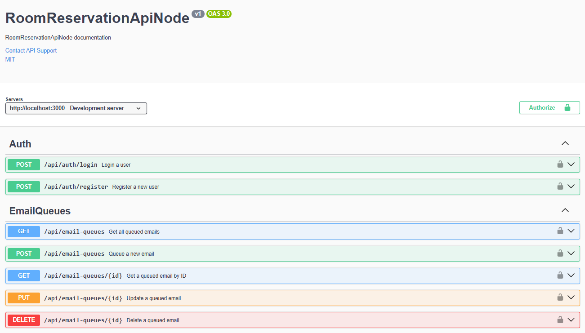
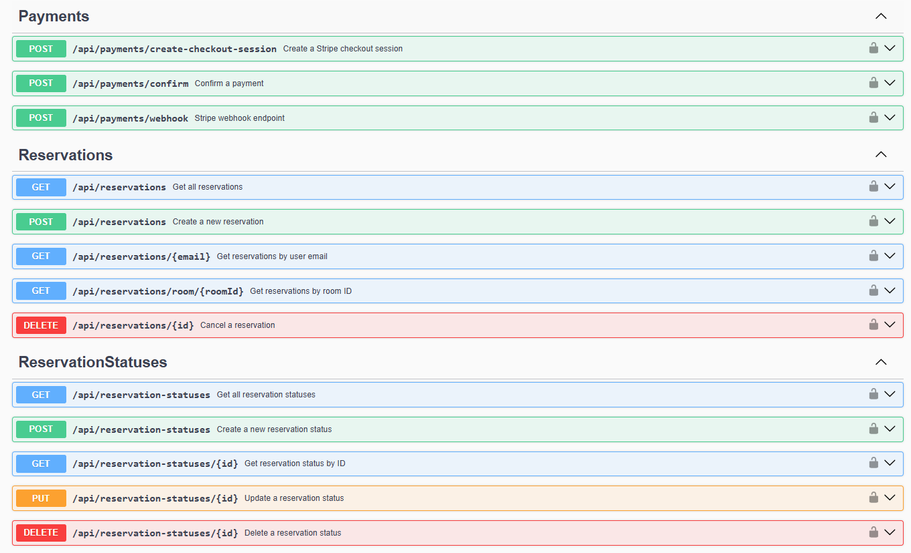
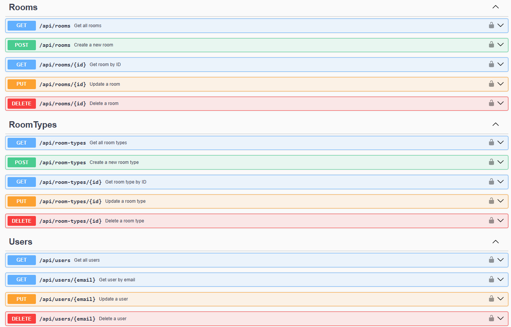
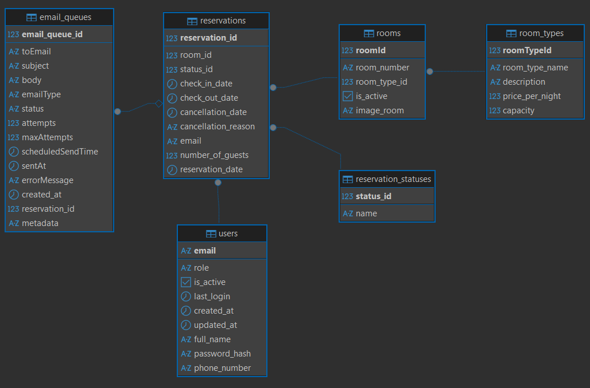

# RoomReservationApiNode

A comprehensive Room Reservation API built with Node.js, TypeScript, and TypeORM, supporting multiple database providers and featuring user authentication, room management, and reservation handling.

## Features And Technologies Used

- **Backend Framework**: Node.js with Express
- **Language**: TypeScript
- **ORM**: TypeORM
- **Database Support**: PostgreSQL, MySQL, SQL Server, SQLite, MongoDB
- **Authentication**: JWT (JSON Web Tokens)
- **API Documentation**: Swagger/OpenAPI
- **Logging**: Winston
- **Validation**: Class-validator
- **Testing**: Jest

## 📁 Project Structure

```
src/
├── config/                # Configuration files
│   ├── data/              # Data source and database configurations
│   └── logger.ts          # Logging configuration
│
├── controllers/           # Request handlers for each route
├── dtos/                  # Data Transfer Objects (DTOs) for request/response
├── middleware/            # Express middleware (auth, error handling, etc.)
├── migrations/            # Database migration files
├── models/                # Database models/entities
├── routes/                # Route definitions
├── services/              # Business logic and data access
└── utils/                 # Utility functions and helpers

scripts/                   # Utility scripts for database and maintenance
└── check-email-conf.ts
└── create-db.ts
└── seed-db.ts

tests/                     # Test files (if any)
```

### Key Directories Explained

- **config/**: Contains all configuration files including database setup and logging
- **controllers/**: Handles HTTP requests and responses
- **dtos/**: Defines the shape of data being transferred between layers
- **middleware/**: Custom Express middleware for authentication, error handling, etc.
- **migrations/**: Database schema migration files
- **models/**: TypeORM entities that map to database tables
- **routes/**: API route definitions
- **services/**: Contains business logic and interacts with the database
- **utils/**: Helper functions and utilities
- **scripts/**: Maintenance and setup scripts for the application

| | | |
| :---: | :---: | :---: |
| <kbd></kbd> | <kbd></kbd> | <kbd></kbd> |


## Requirements

- Node.js 16.x or higher
- npm or yarn
- One of the supported databases:
  - PostgreSQL 12+
  - MySQL 8.0+
  - SQL Server 2019+
  - SQLite3
  - MongoDB 4.4+

## Database Configuration

The application supports multiple database providers. Configure your preferred database in `appsettings.json`:

```json
{
  "DatabaseSettings": {
    "Provider": "PostgreSQL",
    "ConnectionStrings": {
      "SqlServer": "Server=localhost;Database=RoomReservationDb;Trusted_Connection=True;",
      "MySQL": "Server=localhost;Database=RoomReservationDb;User=root;Password=yourpassword;",
      "PostgreSQL": "Host=localhost;Database=room-reservation-db;Username=postgres;Password=yourpassword;",
      "SQLite": "Data Source=RoomReservationDb.db;",
      "MongoDB": "mongodb://localhost:27017/RoomReservationDb"
    }
  }
}
```

## Installation and Execution

1. Clone the repository:
   ```bash
   git clone https://github.com/yourusername/RoomReservationApiNode.git
   cd RoomReservationApiNode
   ```

2. Install dependencies:
   ```bash
   npm install
   ```

3. Configure your environment:
   - Copy `.env.example` to `.env` and update the values
   - Configure your database in `appsettings.json`

4. Run database migrations:
   ```bash
   npm run migration:run
   ```

5. Start the development server:
   ```bash
   npm run dev
   ```

6. Access the API documentation at `http://localhost:3000/api-docs`

## Endpoints

### Authentication
- `POST /api/auth/register` - Register a new user
- `POST /api/auth/login` - Login and get JWT token
- `GET /api/auth/me` - Get current user profile

### Users
- `GET /api/users` - Get all users (admin only)
- `GET /api/users/:id` - Get user by ID
- `PUT /api/users/:id` - Update user
- `DELETE /api/users/:id` - Delete user

### Rooms
- `GET /api/rooms` - Get all rooms
- `GET /api/rooms/available` - Get available rooms in date range
- `GET /api/rooms/:id` - Get room by ID
- `POST /api/rooms` - Create new room (admin only)
- `PUT /api/rooms/:id` - Update room (admin only)
- `DELETE /api/rooms/:id` - Delete room (admin only)

### Reservations
- `GET /api/reservations` - Get all reservations
- `GET /api/reservations/user/:userId` - Get user's reservations
- `GET /api/reservations/:id` - Get reservation by ID
- `POST /api/reservations` - Create new reservation
- `PUT /api/reservations/:id` - Update reservation
- `DELETE /api/reservations/:id` - Cancel reservation

### Payments
- `POST /api/payments/create-payment-intent` - Create payment intent
- `POST /api/payments/webhook` - Stripe webhook handler

## Database Structure

<kbd>
  
</kbd>  

## Email Configuration

Configure the SMTP parameters in `appsettings.json`:

```json
"EmailConfiguration": {
  "FromEmail": "reservations@yourhotel.com",
  "FromName": "Hotel Reservation System",
  "SmtpServer": "smtp.yourhotel.com",
  "SmtpPort": 587,
  "Username": "your-smtp-username",
  "Password": "your-smtp-password"
}
```

## Security

- JWT Authentication
- Password hashing with bcrypt
- Role-based access control
- Input validation
- Rate limiting
- CORS enabled
- Helmet security headers
- CSRF protection

## Example Use Case

1. **User Registration**
   ```bash
   POST /api/auth/register
   {
     "username": "john.doe",
     "email": "john.doe@example.com",
     "password": "SecurePass123!",
     "firstName": "John",
     "lastName": "Doe"
   }
   ```

2. **User Login**
   ```bash
   POST /api/auth/login
   {
     "email": "john.doe@example.com",
     "password": "SecurePass123!"
   }
   ```

3. **Check Room Availability**
   ```bash
   GET /api/rooms/available?checkIn=2025-01-15&checkOut=2025-01-20
   ```

4. **Create Reservation**
   ```bash
   POST /api/reservations
   {
     "roomId": 1,
     "checkInDate": "2025-01-15",
     "checkOutDate": "2025-01-20",
     "guestCount": 2,
     "specialRequests": "Late check-in requested"
   }
   ```

## Stripe Integration

The API includes Stripe integration for handling payments. The following components have been added:

### Configuration
Add your Stripe API keys to `.env`:
```bash
STRIPE_SECRET_KEY=your_stripe_secret_key
STRIPE_WEBHOOK_SECRET=your_webhook_secret
STRIPE_CURRENCY=usd
```

### Endpoints
- `POST /api/payments/create-payment-intent` - Creates a payment intent for a reservation
- `POST /api/payments/webhook` - Handles Stripe webhook events

### Payment Flow
1. Client creates a reservation
2. Server creates a payment intent with the reservation amount
3. Client completes payment using Stripe Elements
4. Webhook updates reservation status on successful payment

### Required Permissions
- `stripe:charges:read`
- `stripe:charges:capture`
- `stripe:payment_intents:create`
- `stripe:payment_intents:retrieve`

## Notes

- The system automatically sends confirmation emails when creating a reservation
- Reminders are sent 2 hours before check-in
- Cancelled reservations are marked in the database but not deleted
- All sensitive data is encrypted at rest and in transit
- Regular database backups are recommended

[DeepWiki moraisLuismNet/RoomReservationApiNode](https://deepwiki.com/moraisLuismNet/RoomReservationApiNode)
